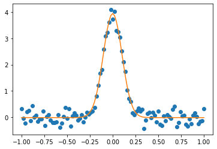

# pyspectra

A small library for spectroscopy

# Install

```
pip install git+https://github.com/fujiisoup/pyspectra.git
```

# Usage

## download atomic spectral data

These method downloads atomic data from NIST ASD.  
https://www.nist.gov/pml/atomic-spectra-database

This method requires some additional packages
+ xarray
+ bs4

```python
import pyspectra

pyspectra.data.atom_levels('Ne')
pyspectra.data.atom_lines('Ne')
```

For the detailed description of each data, see the source webpage.


## refractive index correction
```python
import pyspectra
# convert 600.0 nm wavelength in vacuum to that in (standard) air
pyspectra.refractive_index.vacuum_to_air(600)
```

## unit conversion
```python
import pyspectra

# want to convert 600.0 nm to cm^-1
pyspectra.units.nm_to_cm(600.0)
```

## fit a spectral line

We have a few methods to fit profiles.

```python
import pyspectra

x = np.linspace(-1, 1, 101)
# noisy data
y = pyspectra.profiles.Gauss(x, 1.0, 0, 0.1, 0.0) + np.random.randn(x.size) * 0.2

# fit by a gaussian
popt, perr = pyspectra.fit.singlepeak_fit(x, y, profile='gauss')
fit = pyspectra.profiles.Gauss(x, *popt)

plt.plot(x, y, 'o')
plt.plot(x, fit, '-')
```
